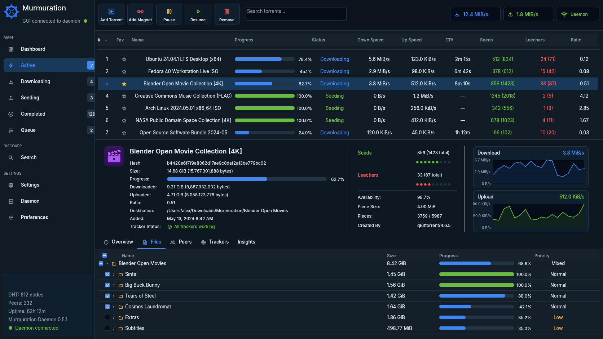
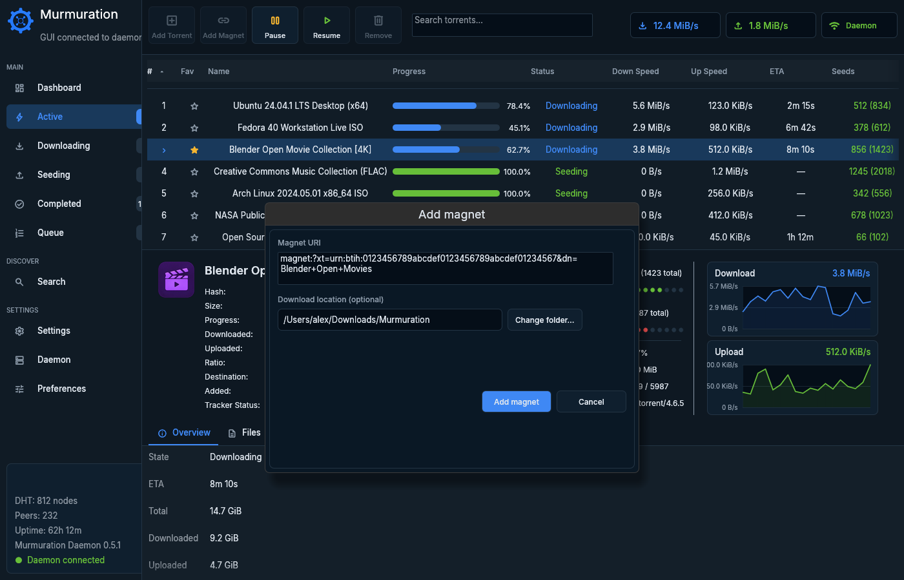
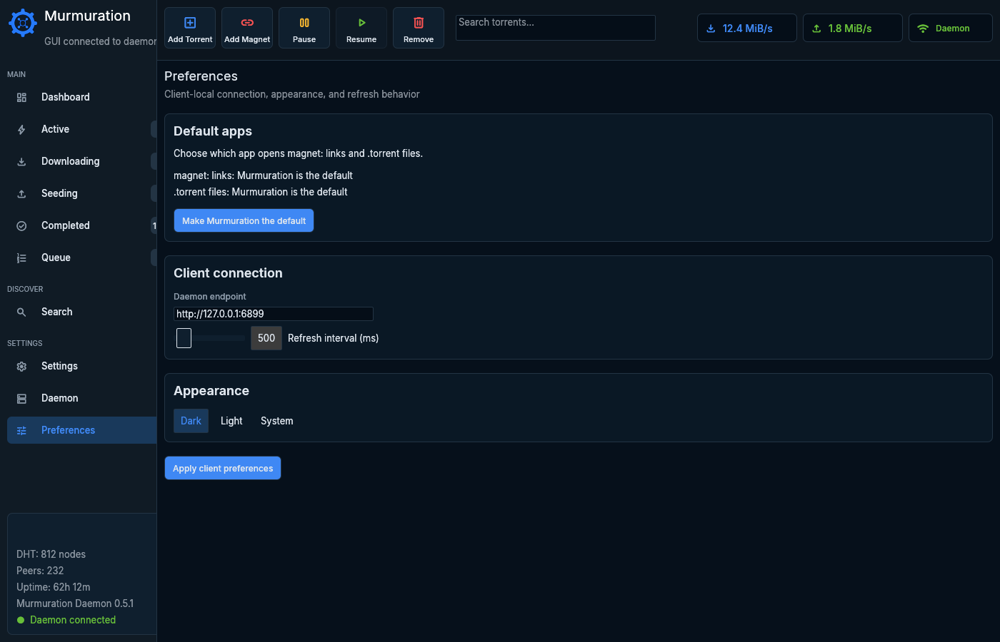

# Murmuration

**A native macOS BitTorrent client built around swarm visibility, durable
downloads, and explicit network control.**

Murmuration combines a responsive desktop interface with a persistent daemon.
You can close the window without stopping active transfers, inspect what each
torrent is doing, and return later without losing state.

[Download the latest preview](https://github.com/forgeopslabs/murmuration-releases/releases)



> [!WARNING]
> Current macOS builds are previews. They are ad-hoc signed but are not yet
> authenticated or notarized by Apple. First launch therefore requires a
> one-time approval in **System Settings > Privacy & Security**. Do not disable
> Gatekeeper or remove quarantine attributes.

## User guide

- [Requirements](#requirements)
- [Install and open](#install-and-open)
- [macOS approvals](#macos-approvals)
- [First run](#first-run)
- [Add a download](#add-a-download)
- [Manage torrents](#manage-torrents)
- [Dashboard, settings, and preferences](#dashboard-settings-and-preferences)
- [Background daemon](#background-daemon)
- [Terminal clients](#terminal-clients)
- [Troubleshooting](#troubleshooting)
- [Uninstall](#uninstall)
- [Releases, source, and licensing](#releases-source-and-licensing)

## What Murmuration provides

- Native desktop GUI for Apple Silicon and Intel Macs.
- BitTorrent v1, v2, and hybrid torrent support.
- `.torrent` files and magnet links, with a native destination-folder picker.
- Persistent background daemon: transfers continue after the GUI closes.
- Download, upload, queue, pause, resume, remove, and per-file controls.
- Detailed torrent views for files, peers, trackers, piece availability, and
  live transfer behavior.
- DHT, tracker, PEX, local-peer discovery, web-seed, and incoming-peer support.
- Private-torrent discovery restrictions and network-scope leak diagnostics.
- Dark, light, and system appearance modes.
- Optional `magnet:` and `.torrent` default-app registration.
- Bundled command-line and terminal clients.

Murmuration does not provide anonymity. BitTorrent peers can see one another's
IP addresses. Protocol encryption can obscure traffic from casual inspection,
but it does not hide your network identity.

## Requirements

| Requirement | Details |
| --- | --- |
| macOS | macOS 11 Big Sur or later |
| Apple Silicon | Download the `macos-arm64.zip` asset |
| Intel | Download the `macos-x86_64.zip` asset |
| Network | Internet access; incoming connections recommended |
| Storage | Space for the app, state, and selected torrent payloads |

To identify your Mac, choose **Apple menu > About This Mac**. A Mac showing an
Apple chip uses the `arm64` build. A Mac showing an Intel processor uses the
`x86_64` build.

## Install and open

### 1. Download and verify

1. Open the [Releases](https://github.com/forgeopslabs/murmuration-releases/releases)
   page and select the newest preview.
2. Download the ZIP matching your Mac:
   - Apple Silicon: `murmuration-VERSION-macos-arm64.zip`
   - Intel: `murmuration-VERSION-macos-x86_64.zip`

Each release includes `SHA256SUMS`. Download it beside the app ZIP, then
calculate the ZIP's checksum before opening the archive:

```sh
shasum -a 256 murmuration-VERSION-macos-arm64.zip
```

Use the `macos-x86_64.zip` filename on an Intel Mac. Compare the printed hash
with the matching line in `SHA256SUMS`. Continue only when they match.

### 2. Install and approve

1. Open the verified ZIP, then drag **Murmuration.app** into **Applications**.
2. Open **Applications** and double-click **Murmuration** once. macOS will block
   this first attempt because the preview is not notarized.
3. Open **System Settings > Privacy & Security**. Scroll to **Security**, find
   the Murmuration message, then choose **Open Anyway**.
4. Authenticate if macOS asks, then confirm **Open**.

This creates a per-app exception. Future launches do not require repeating the
Gatekeeper approval unless you install a different build that macOS treats as a
new app.

Apple documents this process in
[Open a Mac app from an unknown developer](https://support.apple.com/guide/mac-help/open-a-mac-app-from-an-unknown-developer-mh40616/mac).

## macOS approvals

Murmuration asks only for access connected to downloading and peer networking.
Prompts vary by macOS version, firewall configuration, and chosen destination.
The embedded daemon may appear as `murmurd` in some system prompts.

| Approval | Recommendation | Why it is used | If denied |
| --- | --- | --- | --- |
| Gatekeeper **Open Anyway** | Required for current preview | Allows this non-notarized build to launch | App cannot open |
| Downloads or selected-folder access | Allow for folders you choose | Reads `.torrent` files and writes downloaded payloads | Choose another folder or enable access later |
| Local Network | Allow for full peer discovery | Finds and connects to peers on your LAN | Local-peer discovery is unavailable |
| Incoming network connections | Allow | Lets remote peers connect, improving reachability and seeding | Outgoing transfers may work, but peer reachability is reduced |
| Make Murmuration the default | Optional | Opens `magnet:` links and `.torrent` files in Murmuration | Existing default app remains unchanged |

Murmuration does **not** require Accessibility, Full Disk Access, Screen
Recording, Camera, Microphone, Contacts, or Location access.

You can review access later:

- **System Settings > Privacy & Security > Files and Folders** — see
  [Apple's Files and Folders guide](https://support.apple.com/guide/mac-help/control-access-to-files-and-folders-on-mac-mchld5a35146/mac).
- **System Settings > Privacy & Security > Local Network** — see
  [Apple's Local Network guide](https://support.apple.com/guide/mac-help/control-access-to-your-local-network-on-mac-mchla4f49138/mac).
- **System Settings > Network > Firewall > Options** — see
  [Apple's Firewall guide](https://support.apple.com/guide/mac-help/change-firewall-settings-on-mac-mh11783/mac).

## First run

Opening Murmuration automatically starts the bundled `murmurd` daemon if a
compatible daemon is not already running. The green **Daemon** indicator means
the GUI is connected.

Default locations:

| Data | Location |
| --- | --- |
| Downloaded payloads | `~/Downloads/Murmuration` |
| Persistent state | `~/Library/Application Support/Murmuration` |
| Logs | `~/Library/Logs/Murmuration` |
| Local daemon endpoint | `http://127.0.0.1:6899` |

The RPC endpoint is loopback-only by default. It is for local GUI, TUI, and CLI
communication; do not expose it to another network.

If the daemon cannot start, Murmuration offers **Retry**, **Open Logs**, and
**Close**. Open the logs first when reporting or investigating a startup error.

## Add a download

Only download or share content you are permitted to use.

### Add a `.torrent` file

1. Choose **Add Torrent** in the toolbar.
2. Choose the `.torrent` file.
3. Keep the daemon default download location or choose **Change folder…**.
4. Review the paths, then choose **Add torrent**.

Murmuration validates the selected file before submitting it. If the source
file changes or disappears while being read, select it again.

### Add a magnet link

1. Choose **Add Magnet**.
2. Paste a complete URI beginning with `magnet:?`.
3. Keep the default destination or choose **Change folder…**.
4. Choose **Add magnet**.



Canceling the folder picker leaves the current destination unchanged. Magnet
metadata can take time to arrive when trackers or peers are slow; the download
appears after the daemon has enough metadata to identify it.

You can also open a `.torrent` file or `magnet:` link from another app after
making Murmuration the default in **Preferences**.

## Manage torrents

The left sidebar filters the workspace by **Active**, **Downloading**,
**Seeding**, **Completed**, and **Queue**. Use the toolbar search field to
narrow the current list.

Select a torrent, then use:

- **Pause** — stop transfer activity while retaining state.
- **Resume** — continue a paused torrent.
- **Remove** — choose whether to keep or delete downloaded data.
- **Overview** — progress, destination, ratio, swarm, and tracker health.
- **Files** — file tree, completion, and priorities.
- **Peers** — connected peers and transfer accounting.
- **Trackers** — tracker state, peer counts, and errors.
- **Insights** — piece availability, transfer history, upload slots, and disk
  activity.

> [!CAUTION]
> **Remove > Delete downloaded data** deletes payload files owned by that
> torrent. Choose **Keep downloaded data** when you only want to remove the
> torrent from Murmuration.

## Dashboard, settings, and preferences

**Dashboard** summarizes active torrents, connected peers, and aggregate
transfer rates. **Daemon** shows version, uptime, DHT state, free space, and
snapshot revision.

**Settings** lets you edit daemon-owned transfer limits and displays the
daemon-owned queue limits. Transfer changes apply to every connected client and
remain active after the GUI closes. A value of `0` means unlimited where shown.

**Preferences** contains client-local options:

- Make Murmuration the default for `magnet:` and `.torrent` opens.
- Change local daemon endpoint.
- Adjust GUI refresh interval.
- Select dark, light, or system appearance.



Default-handler registration depends on the macOS version and Launch Services.
If macOS rejects a `.torrent` change, select a `.torrent` file in Finder, choose
**Get Info > Open with**, select the preferred app, then choose **Change All…**.
If a `magnet:` change is rejected, keep the current handler; no qualified
manual recovery flow is currently provided.

## Background daemon

Closing or quitting the GUI does not stop active transfers. Reopen Murmuration
to reconnect to the existing daemon.

To stop it gracefully from Terminal:

```sh
/Applications/Murmuration.app/Contents/Resources/bin/murmur shutdown
```

After an update, the app may ask to restart an older daemon. Approve the
restart, or run:

```sh
/Applications/Murmuration.app/Contents/Resources/bin/murmur daemon restart
```

## Terminal clients

Release ZIPs include a terminal UI and command-line client. Both start the
bundled daemon on demand when possible.

### Terminal UI

```sh
/Applications/Murmuration.app/Contents/Resources/bin/murmur-tui
```

Use a terminal at least 72 columns by 20 rows. Press `?` inside the TUI for its
current key guide.

### CLI examples

```sh
MURMUR=/Applications/Murmuration.app/Contents/Resources/bin/murmur

"$MURMUR" list
"$MURMUR" stats
"$MURMUR" add /path/to/file.torrent
"$MURMUR" status 1
"$MURMUR" remove 1
"$MURMUR" leakcheck
```

CLI `remove` keeps downloaded data. Use the GUI when you need the explicit
keep-data/delete-data choice.

## Troubleshooting

### “Murmuration cannot be opened”

Use the one-time **Privacy & Security > Open Anyway** process above. Do not run
commands that disable Gatekeeper or strip quarantine metadata.

### Daemon does not connect

1. Choose **Open Logs** from the startup error, or open
   `~/Library/Logs/Murmuration` in Finder.
2. Check whether another Murmuration version is running.
3. Run `murmur daemon restart` using the full path above.
4. Reopen the app.

### Downloads do not start

- Confirm the destination exists and has free space.
- Review **Privacy & Security > Files and Folders**.
- Allow Local Network and incoming connections if macOS prompted.
- Open **Trackers**, **Peers**, and **Insights** for source or availability
  errors.
- Some magnet links have no reachable metadata peers and cannot start.

### Magnet or `.torrent` links open in another app

Open **Preferences**, choose **Make Murmuration the default**, and confirm. If
macOS rejects a `.torrent` change, use Finder's **Get Info > Open with > Change
All…** flow. If it rejects a `magnet:` change, keep the current handler.

### Where are logs?

Open `~/Library/Logs/Murmuration` in Finder. The daemon log is
`murmurd.log`.

## Uninstall

1. Quit the GUI.
2. If Murmuration is your default app, choose another BitTorrent app as the
   default for `.torrent` files and `magnet:` links using that app's controls.
3. Stop the daemon with
   `/Applications/Murmuration.app/Contents/Resources/bin/murmur shutdown`.
4. Move **Murmuration.app** from **Applications** to the Trash.

Normal removal leaves support data and downloaded payloads in place. For a full
reset, review and move only these Murmuration-owned items to the Trash:

- `~/Library/Application Support/Murmuration`
- `~/Library/Caches/org.murmuration-bt.murmuration`
- `~/Library/Logs/Murmuration`
- `~/Library/Preferences/org.murmuration-bt.murmuration.plist`
- `~/Library/Saved Application State/org.murmuration-bt.murmuration.savedState`

Downloaded payloads are separate. Delete `~/Downloads/Murmuration` or another
chosen destination only when you intend to erase those files too.

## Releases, source, and licensing

This public repository contains distribution artifacts, checksums, release
notes, and the GPL Corresponding Source archive for each published version.

- Applications are licensed under GPL-3.0-or-later.
- Engine libraries are licensed under MIT OR Apache-2.0.
- Exact Corresponding Source is attached to each release.

Preview limitations and first-launch instructions are also repeated in each
release's notes.
